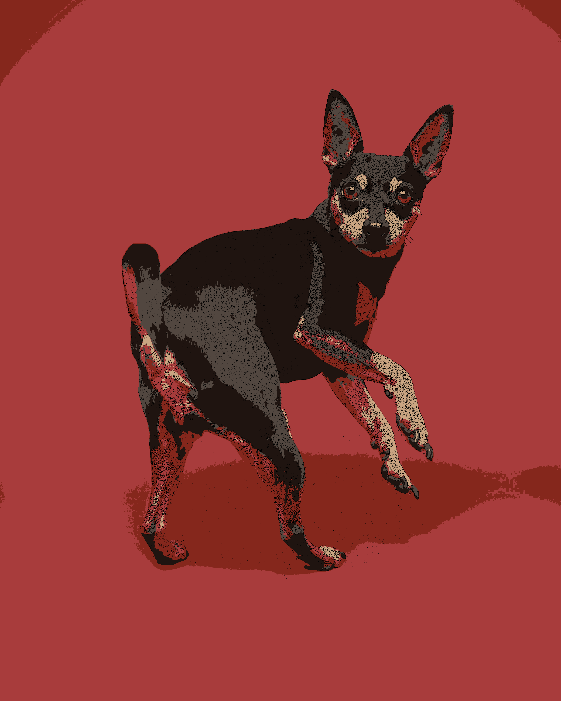

# Rendering Several Images To Cartoon

It is simple Python program that render a image you choose and save it using OpenCV.

## Feature

- Load a image from directory

- Origine Image : Load the origine image

- Cartoon Style : Render the origine image to cartoon style 

- Save a image : Save a displayed image

- Exit or click ESC : Shut down the program

## Good Result
- dog, indian, 

## Bad Result

## My Opinion
