# Rendering Several Images To Cartoon

It is simple Python program that render a image you choose and save it using OpenCV.

## Feature

- Load a image from directory

<table>
  <tr>
    <td>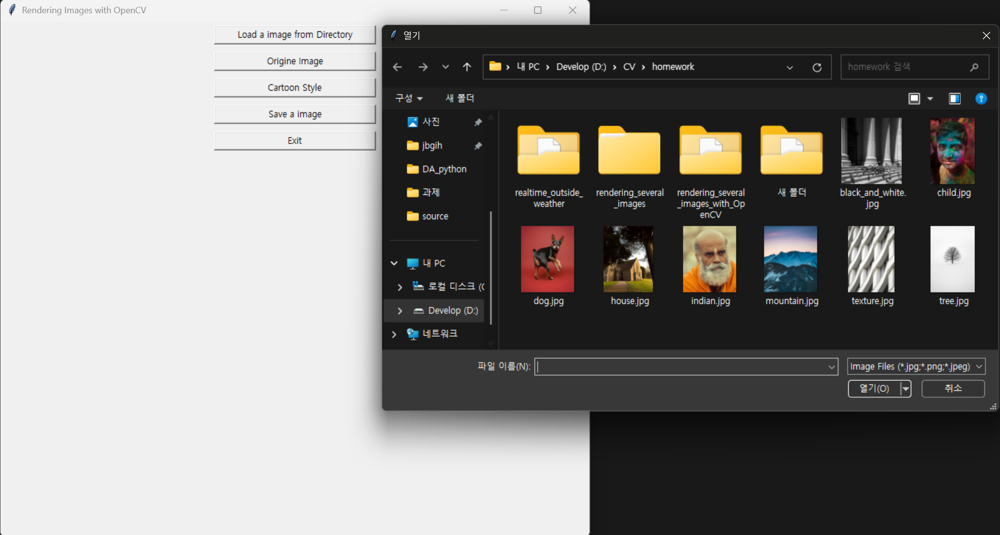</td>
  </tr>
</table>

- Origine Image : Load the origine image
  
<table>
  <tr>
    <td>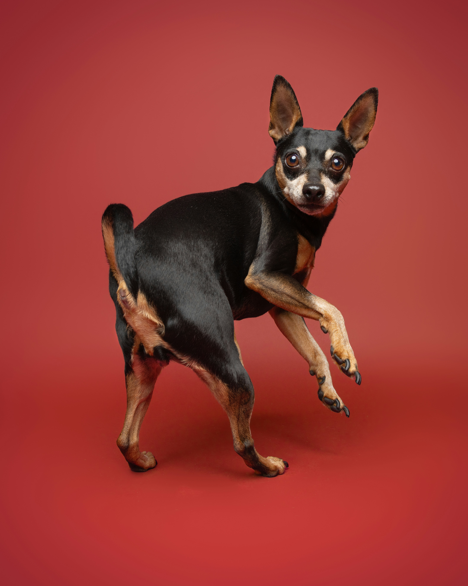</td>
  </tr>
</table>

- Cartoon Style : Render the origine image to cartoon style 

<table>
  <tr>
    <td></td>
  </tr>
</table>

- Save a image : Save a displayed image

- Exit or click ESC : Shut down the program

## Good Results
- Dog, Indian, Texture, Figure, Figure_2 are good results. Because they seem like pictures. And It brings out the original features (color, divisions) well.

<table>
  <tr>
    <td></td>
    <td>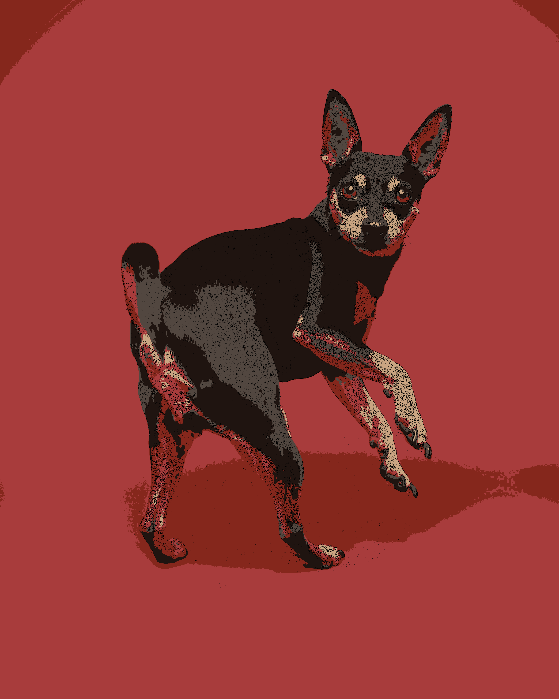</td>
  </tr>
  <tr>
    <td align="center">Dog</td>
    <td align="center">Cartoon Style Dog</td>
  </tr>
</table>

<table>
  <tr>
    <td>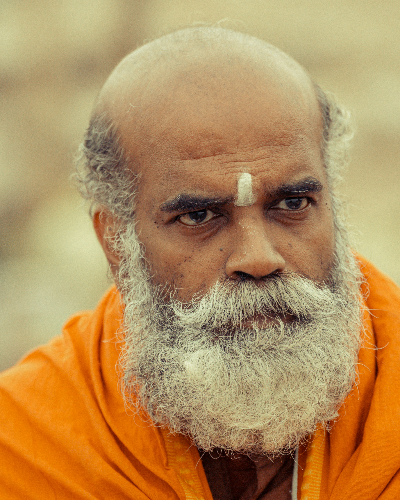</td>
    <td>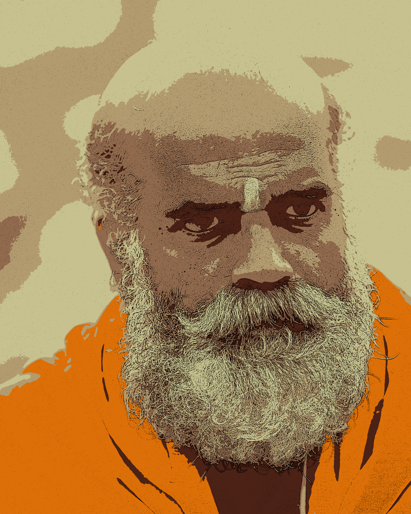</td>
  </tr>
  <tr>
    <td align="center">Indian</td>
    <td align="center">Cartoon Style Indian</td>
  </tr>
</table>

<table>
  <tr>
    <td>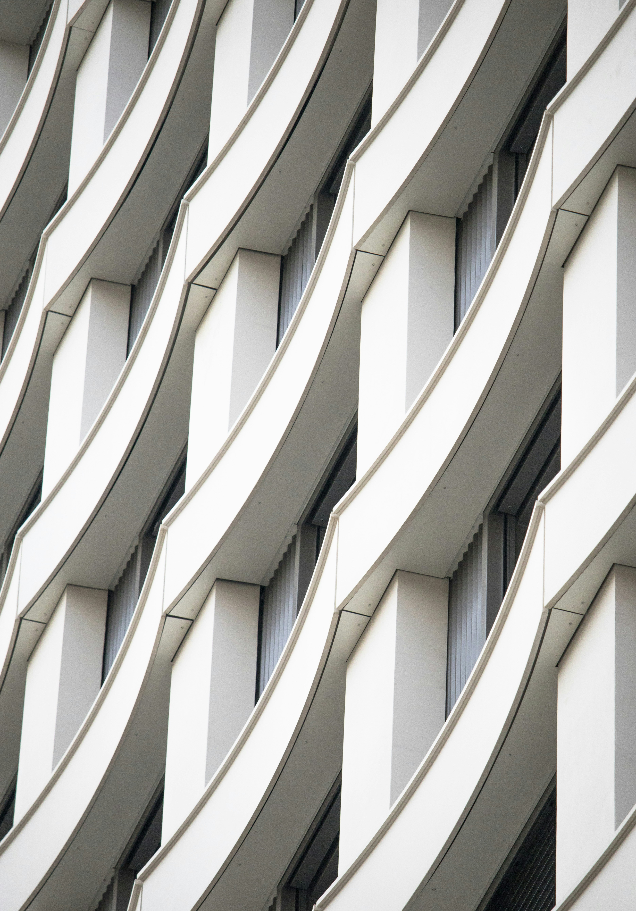</td>
    <td>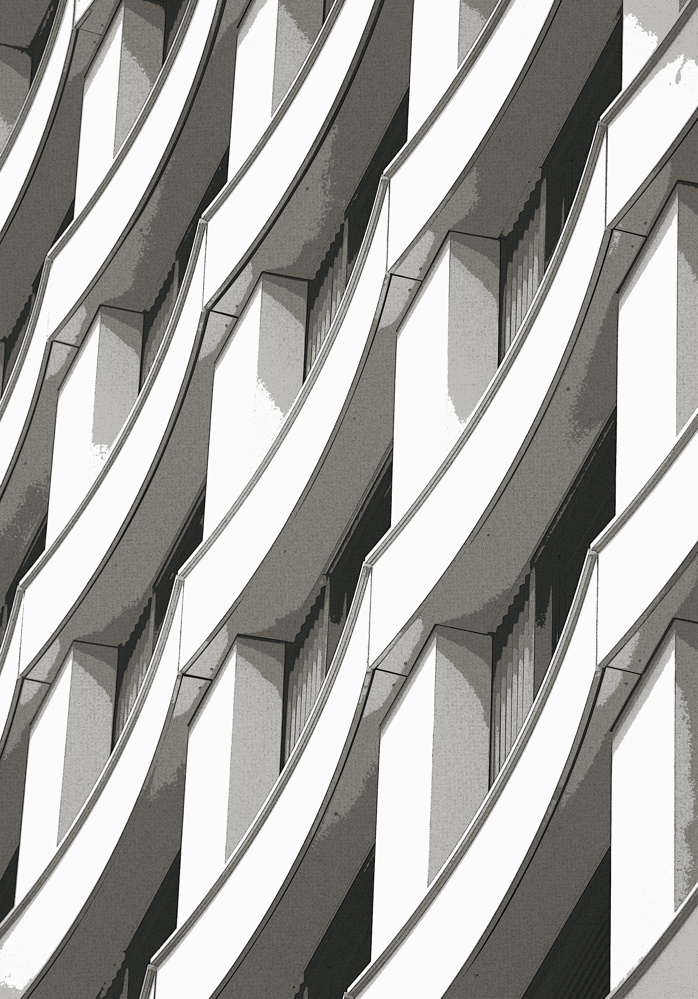</td>
  </tr>
  <tr>
    <td align="center">Texture</td>
    <td align="center">Cartoon Style Texture</td>
  </tr>
</table>

<table>
  <tr>
    <td>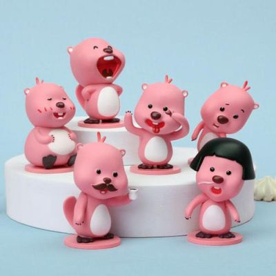</td>
    <td>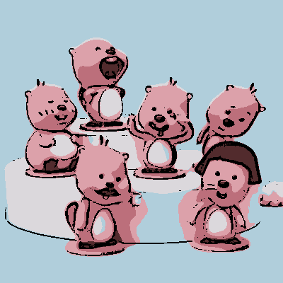</td>
  </tr>
  <tr>
    <td align="center">Figure</td>
    <td align="center">Cartoon Style Figure</td>
  </tr>
</table>

<table>
  <tr>
    <td>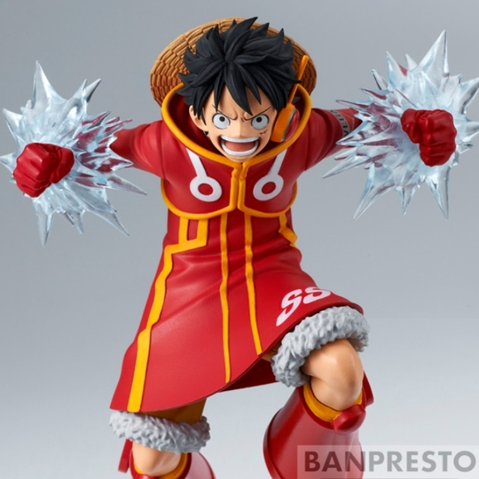</td>
    <td>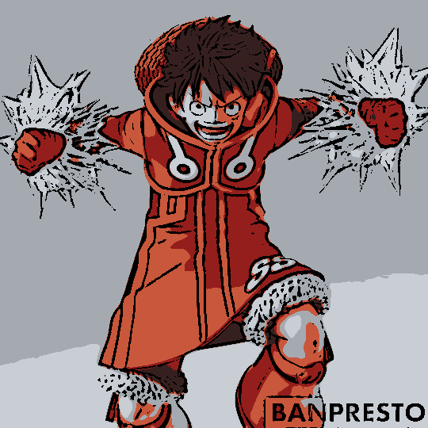</td>
  </tr>
  <tr>
    <td align="center">Figure_2</td>
    <td align="center">Cartoon Style Figure_2</td>
  </tr>
</table>

## Bad Results
- black_and_white, child, house, moutain, texture, tree are bad results. Because they can't brings out the origine features (color, divisions) well or are close to the origine photo.

<table>
  <tr>
    <td>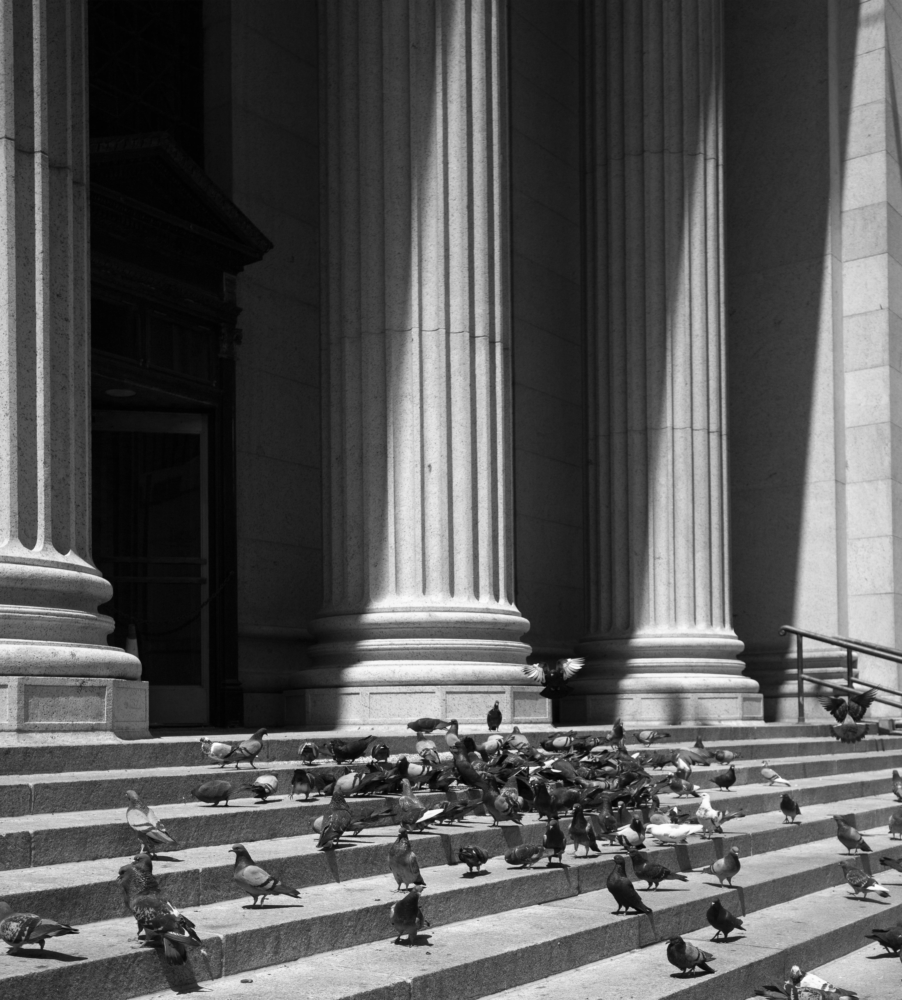</td>
    <td>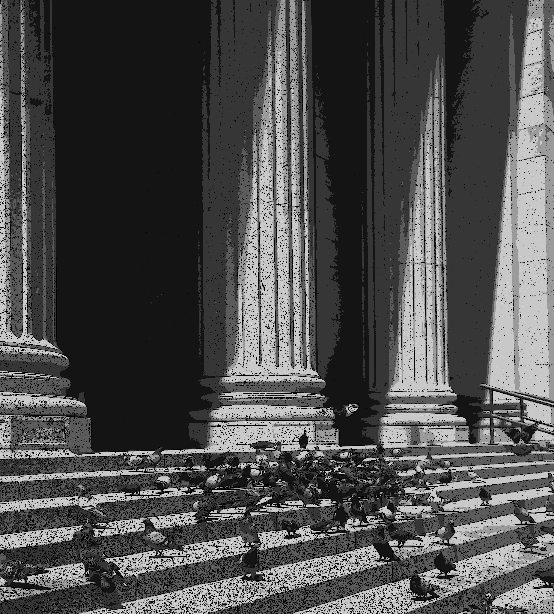</td>
  </tr>
  <tr>
    <td align="center">Black and White</td>
    <td align="center">Cartoon Style Black and White</td>
  </tr>
  
  <tr>
    <td>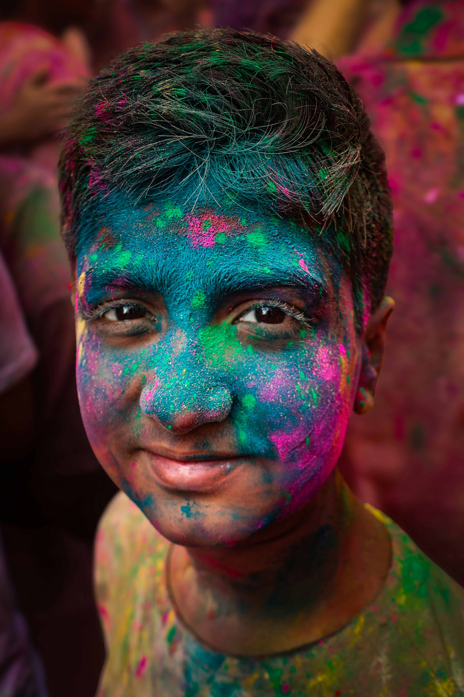</td>
    <td>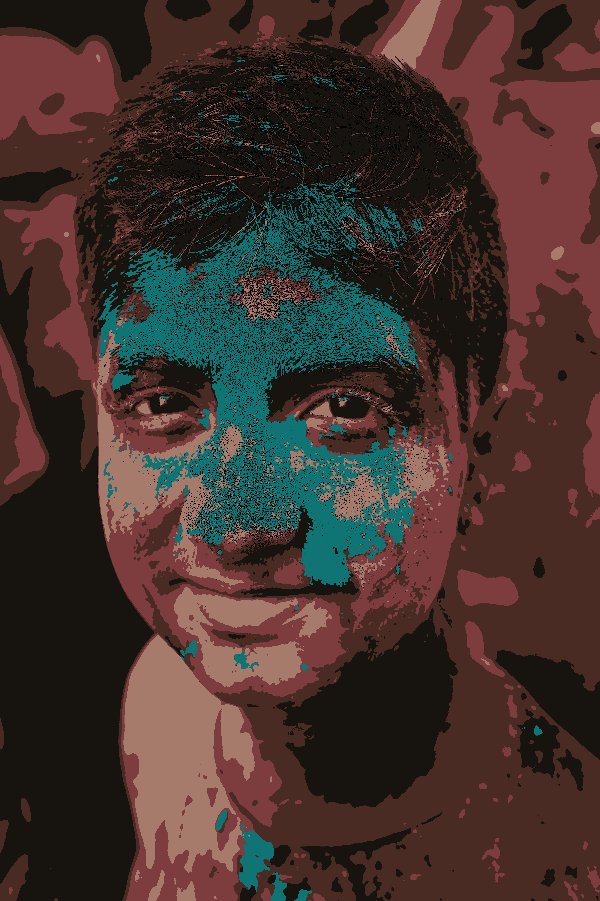</td>
  </tr>
  <tr>
    <td align="center">Child</td>
    <td align="center">Cartoon Style Child</td>
  </tr>

  <tr>
    <td></td>
    <td></td>
  </tr>
  <tr>
    <td align="center">House</td>
    <td align="center">Cartoon Style House</td>
  </tr>

  <tr>
    <td></td>
    <td></td>
  </tr>
  <tr>
    <td align="center">Mountain</td>
    <td align="center">Cartoon Style Mountain</td>
  </tr>

  <tr>
    <td>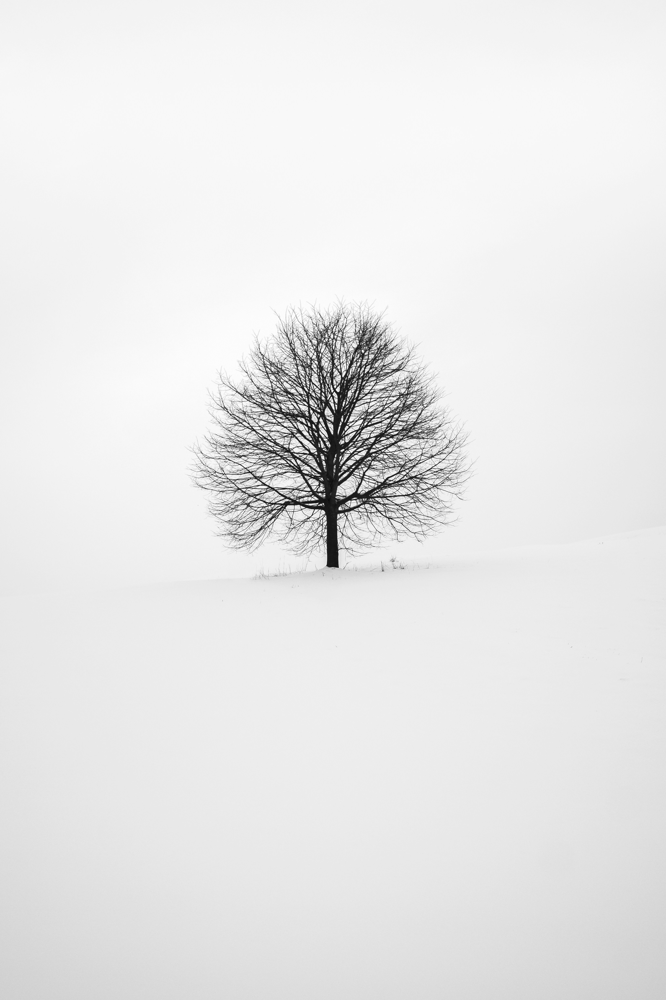</td>
    <td>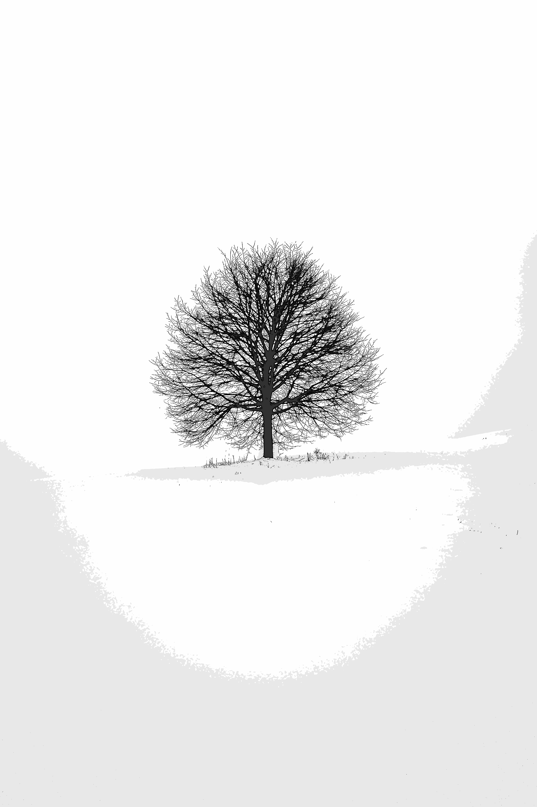</td>
  </tr>
  <tr>
    <td align="center">Tree</td>
    <td align="center">Cartoon Style Tree</td>
  </tr>
</table>

## My Opinion
-  Actually the Good Results can't be called cartoon style. Exactly it is close to drawing or painting. It is accepted that the cartoon is a kind of drawings or paintings. Good Results can be called cartoon. Becausee Good Results brings out the origine features (color, divisions) well but Bad Results can't.
-  I think my program need to render stronger edge and clear, vivid and saturated color.
